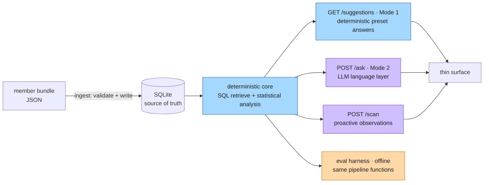
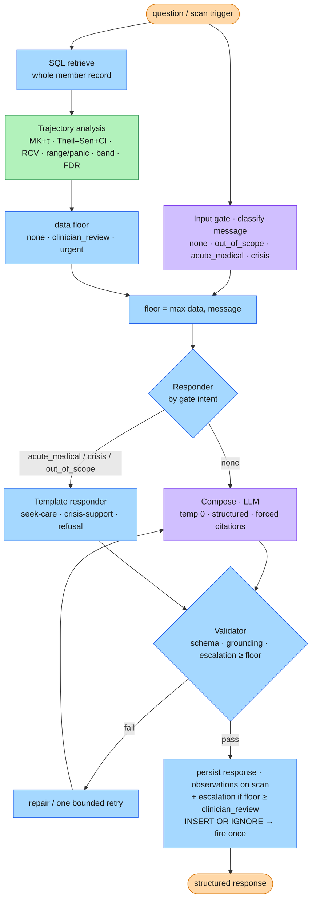
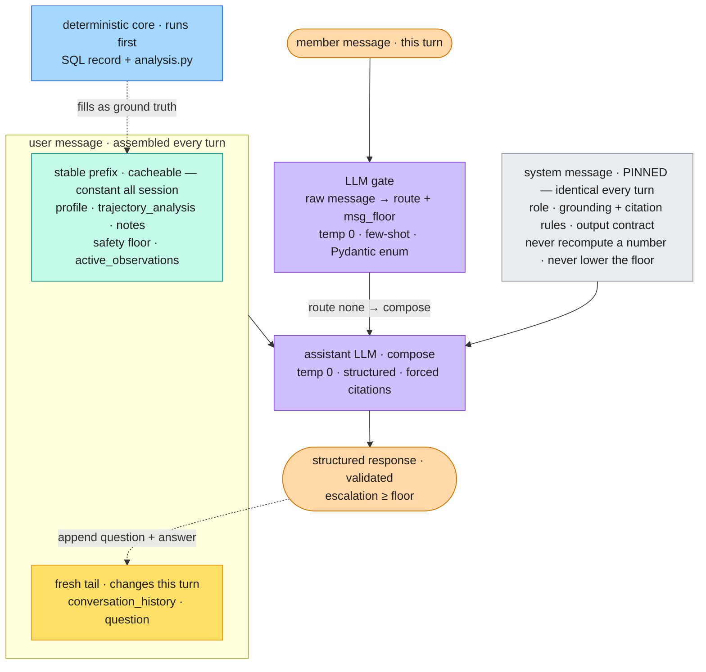
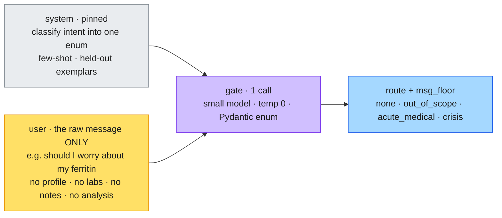
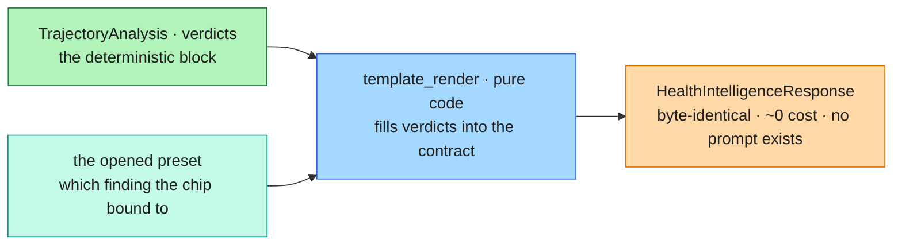
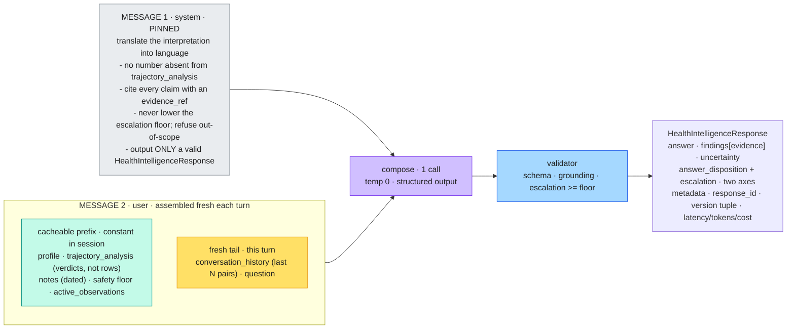
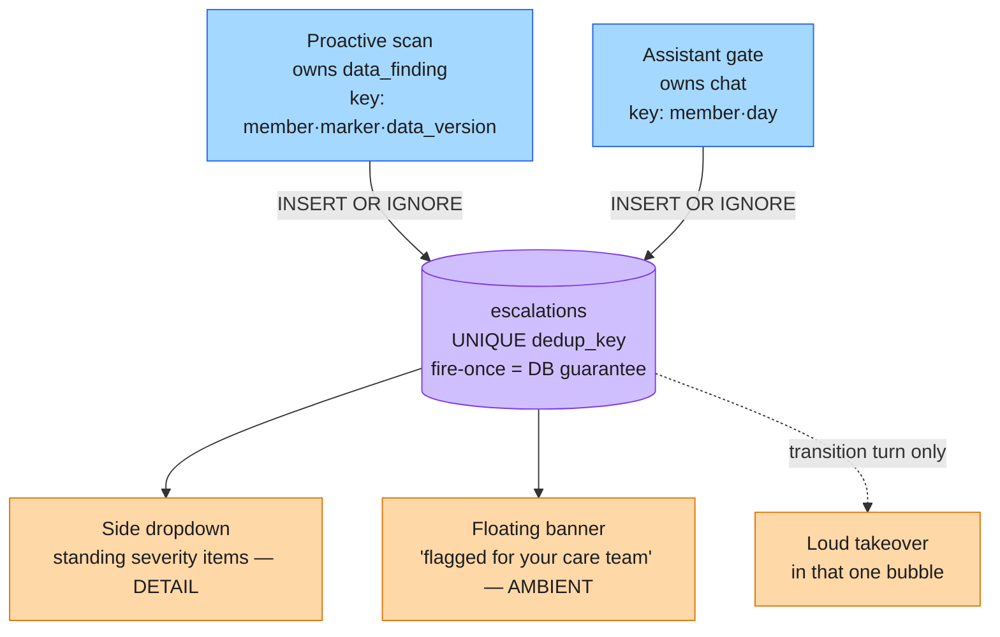
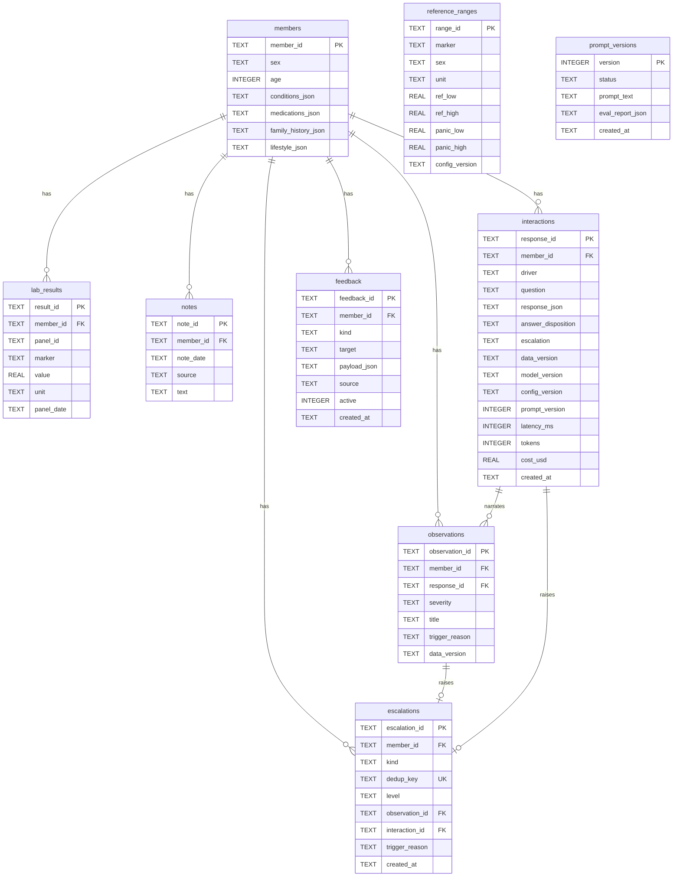
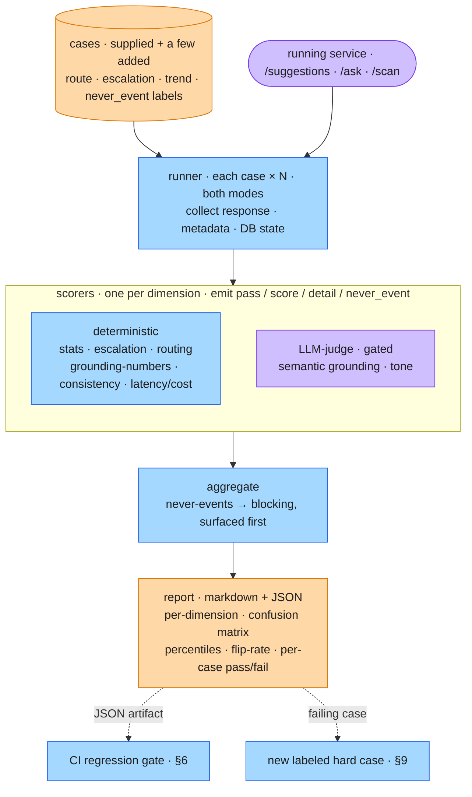
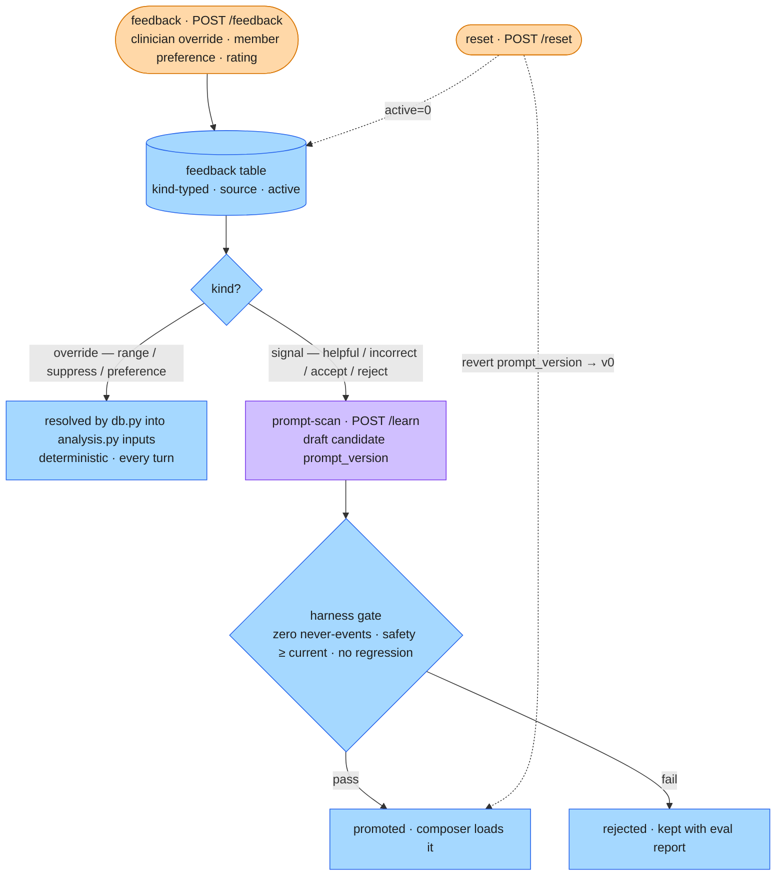

# Health Intelligence Service — Architecture

> A persistent Health Intelligence Service: two behaviors — grounded Q&A and proactive drift observations — over a member's longitudinal record, with safe refusal/escalation, explainability, and consistency throughout. Synthetic data only; no PHI.

**Organizing principle.** The LLM is a *language interface over a deterministic analytical core*, not the core itself. Every number, reference-range comparison, trend call, and escalation decision is computed by deterministic code or classical statistics; the LLM only renders that ground truth into careful language within guardrails it cannot override. "Show your work" is then structurally cheap — the opaque component never produced a load-bearing fact — which is the defensible posture near a clinician.

---

## Contents

- [Build sequence](#build-sequence)
- [1. Service shape](#1-service-shape)
- [2. Key design decisions](#2-key-design-decisions)
  - [Mode 1 conversation loop](#mode-1-conversation-loop)
  - [Per-turn message shapes (the chat loop)](#per-turn-message-shapes-the-chat-loop)
  - [What each LLM call site receives](#what-each-llm-call-site-receives)
  - [Escalation model (both behaviors)](#escalation-model-both-behaviors)
  - [D3 in detail — the signals + triage](#d3-in-detail--the-signals--triage)
  - [analysis.py — the deterministic core (module spec)](#analysispy--the-deterministic-core-module-spec)
- [3. AI vs non-AI boundary table](#3-ai-vs-non-ai-boundary-table)
- [4. Data model](#4-data-model)
- [5. Latency & cost budget](#5-latency--cost-budget)
- [6. Production posture](#6-production-posture)
- [7. Consistency](#7-consistency)
- [8. Evaluation harness](#8-evaluation-harness)
  - [eval/harness.py — the harness (module spec)](#evalharnesspy--the-harness-module-spec)
- [9. Feedback loop & self-improvement](#9-feedback-loop--self-improvement)
  - [Self-improvement (the live slice)](#self-improvement-the-live-slice)
- [10. How output lands with a member (+ one tension)](#10-how-output-lands-with-a-member--one-tension)
- [11. Explicitly out of scope (deliberate cuts)](#11-explicitly-out-of-scope-deliberate-cuts)
- [12. Design priorities](#12-design-priorities)
- [13. API surface](#13-api-surface)
- [14. Repository layout](#14-repository-layout)
- [15. Running and deployment](#15-running-and-deployment)

---

## Build sequence

Dependency-driven and **deterministic-first**: the statistical core and the entire non-LLM system are built and tested before the LLM goes on top, so there is a working deterministic system at the halfway mark — the proactive behavior and every safety decision, with no LLM, a viable assistant in its own right — and the LLM arrives as a language layer over a base that already decides everything safety-relevant. Every phase leaves something runnable, and the API surface **accretes as thin route adapters per phase** rather than as one late step. We do not scaffold everything up front; each phase adds only what the next one needs. Section numbers point into the detailed design below; route names in the phases are shorthand for their §13 paths (e.g. `/ask` is `POST /members/{id}/ask`).

**Phase 0 — Shape (contracts, config, DDL; no logic).** Initialize the backend as a **`uv`-managed project** (`uv init`, then `uv add` for dependencies) — `uv` owns the virtualenv and dependency resolution via `pyproject.toml` + `uv.lock`, so every later phase runs in one reproducible environment. Write `config.py` (the model pin, the statistical thresholds — Mann–Kendall α, FDR `q`, minimum series length `n_min`, Theil–Sen settings, band cut-points — and the per-marker clinical constants: CVa/CVi, adverse-direction, **panic thresholds**, the graded **Vitamin-D bands**, and **vital bounds** — all curated, since the supplied data carries no critical thresholds — plus `config_version`), `models.py` (every Pydantic contract: `MemberBundle` (the upload/ingest input: `member_id` + `profile` + `panels[]` + `notes[]`) and `AskRequest` (`{message}`); `MemberProfile` (`member_id`, `age`, `sex`, `conditions`, `medications`, `family_history`, `lifestyle`), `LabResult` (`marker`, `value`, `unit`, `panel_id`, `panel_date`), `Note` (`date`, `source`, `text`), `ReferenceRange`, `TrendResult`, `MarkerTrajectory`, `TrajectoryAnalysis`, `HealthIntelligenceResponse`, `Observation`, `Escalation`, `Feedback`, `SuggestedPrompt`), and `schema.sql` (the nine tables). This is first because every later module imports the models, ingestion and `db.py` both conform to them, and the schema is the persistence contract — and because it is pure declaration it costs little. → *Runnable:* `schema.sql` loads into SQLite and the models round-trip-validate. *(§4)*

**Phase 1 — Load the bundle + the deterministic core.** Load the supplied bundle (15 members, 3–5 panels across ~2 years, real but **unlabeled** trajectories) into `data/`, and author a few tiny synthetic fixtures with **known** trends for unit testing (the data README permits extension; these give the analysis tests a ground-truth answer the supplied members deliberately withhold), then build `analysis.py` — the pure core: Mann–Kendall (with Kendall's τ and an exact small-n p-value) for monotonic-trend significance, Theil–Sen (with its CI) for direction and rate, Reference Change Value for clinical-vs-noise, reference-range and panic flags, band-crossing, and direction-aware triage with a Benjamini–Hochberg FDR pass across markers, emitting a typed `TrajectoryAnalysis` — with its unit tests. This is the heart of the system and the part that most warrants scrutiny, so it is proven in isolation before anything is wired to it; because `analysis.py` is pure (no DB, no LLM) it is unit-testable directly against the known-answer fixtures ("a seeded downward slope — Mann–Kendall must flag it significant and Theil–Sen must recover the rate"). At `n` as low as **3** (the sparse member) the tests must confirm the honest verdict — *too short to call a trend* — as a first-class output, not a failure. These signals are classical statistics + clinical thresholds, *not* trained ML — a distinction to keep precise. → *Runnable:* the signals on the fixtures and on a supplied member, trend-vs-noise on a deliberately noisy marker, graceful abstention at n=3, and the escalation floor each finding implies. *(§2 D3 + the `analysis.py` module spec)*

**Phase 2 — Data layer.** Build `db.py` (connect, `init_db`, the member/range/interaction queries, the idempotent escalation emit via a UNIQUE `dedup_key` + `INSERT OR IGNORE`, and the resolution of active `feedback` overrides into `analysis.py`'s inputs so the core stays pure) and `preprocessing/ingest.py` — the normalization adapter (firewall): flatten each member's `panels → lab_results` (synthesizing `result_id`, mapping `analyte`→`marker`, carrying `panel_id`), fold `vitals` (BP, BMI) in as markers with config-supplied units, parse the **five reference-range shapes** the data prints (`low-high`, `<high`, `>low`, `>=low`, sex-split, and the Vitamin-D multi-band) into `reference_ranges`, and store `notes` with their `source`; validate against the models → write SQLite — runnable as the loader CLI from here, exposed as the `POST /members` route in Phase 6. Units are consistent per marker (no conversion) and marker names are already canonical (no alias resolution), so don't build those. Now the core runs over *persisted* data rather than in-memory fixtures, with `db.py` as the only module touching SQLite. The override-resolution seam is built here even though `feedback` is populated much later — it is the single place the deterministic half of self-improvement plugs in, and isolating it now keeps `analysis.py` pure forever. → *Runnable:* ingest the bundle, query a member, run analysis over the DB; re-ingesting the same `member_id` replaces that member and bumps `data_version`. *(§4, §7, §9)*

**Phase 3a — Proactive deterministic spine (Mode 1, part 1; no LLM).** Build `safety.py` (the data floor from the analysis, and the output validator enforcing `escalation ≥ floor`), the safety responders in `templates.py` (seek-care, crisis-support, refusal), and the analysis→`HealthIntelligenceResponse` templating (verdicts → the response contract carrying `evidence[]` + floor + a terse summary). Wire the proactive **scan** — the deterministic half of `pipeline.py`'s scan: `analysis` → `observations` (severity + `trigger_reason`), each persisted with its deterministic `HealthIntelligenceResponse` so it satisfies the `interactions` FK — plus the `data_finding` escalation emit. Stand up the web layer here, where the first routes need it: `api.py` (the FastAPI app, the static-file mount, and the routes `/scan`, `/observations`, `/escalations`, `/health`) and the `Makefile`, so the one-command local run becomes real (the `uv`-managed `pyproject.toml` exists from Phase 0). This is your first runnable vertical slice, and every safety-relevant decision now lives in deterministic, auditable code — which is what makes the LLM safe to add later. → *Runnable:* `make run` serves the app on one port; scanning a supplied member surfaces a real trend as a ranked observation; the stored critical potassium (K⁺ 6.1) forces an `urgent` floor and writes exactly one escalation; a re-scan is idempotent. *(§2 escalation model + D3 triage, §6)*

**Phase 3b — Reactive Mode 1 answering (no LLM).** Build `suggest_prompts(analysis, observations, notes, focus, asked)` (the data-derived preset prompts, parameterized by conversation state), the reactive answer path (a selected preset answered by templating the same verdicts into a `HealthIntelligenceResponse` — the 3a response builder reused, no model call), and the **Mode 1 loop** (regenerate the next chips after each answer); expose `/suggestions`. This completes **Mode 1**: proactive findings, severity ranking, evidence-backed narration, the escalation floor, the clinician-review queue, *and* deterministic answers to the anticipated questions — a clinician-trustworthy, no-LLM assistant, viable on its own and the calm default surface (§2), and the base the LLM goes on top of as Mode 2 next. → *Runnable:* a preset answers deterministically and byte-identically; selecting it regenerates the next chips — the conversation loop, no dead-ends. *(§2 modes + the Mode 1 conversation loop, §7)*

**Phase 4 — LLM layer = Mode 2 (LLM on).** Build `llm.py` (the `compose()` interface and the provider — the only network seam besides the gate), `gate.py` (the single Pydantic-enum classifier routing the raw message to `none | out_of_scope | acute_medical | crisis` and setting a message floor, at temperature 0 with few-shot on held-out hard-case exemplars), the composer's per-turn context assembly and prompt, and **extend** `pipeline.py` with the ask path (gate → `floor = max(data, message)` → route to open compose or a safety template → validate → escalate) and the LLM **enrichment** of the Phase-3a scan narration (replacing the terse templated summary with natural prose; evidence and floor unchanged); add `/ask` — this is **Mode 2**, toggled against Mode 1. The LLM lands on a base that already works, as a pure language layer: it renders ground truth and routes open language while the floor, the validator, and the escalation logic from Phase 3a sit *around* it and can override it — the gate being the only point at which a typed message (an emergency with otherwise-normal labs) can raise the floor on its own. The composer is a language layer, not an agent: control flow stays a deterministic `match`, which is what satisfies the agentic criterion without an autonomous tool-loop. → *Runnable:* free-form answers grounded in evidence; a typed emergency with normal labs still escalates; the validator rejects an under-floor output and one bounded retry repairs it; substance identical across re-runs while only prose phrasing varies. *(§2 D1/D4, the per-turn message-shape + injection diagrams, §3)*

**Phase 5 — Evaluation harness.** Build `eval/harness.py` (`run_eval` over a live `ServiceClient`, calling the service N× per case) and `eval/cases/` (the supplied 17-case set loaded as-is — fields `id, member_id, category, input, expected_behavior, must_include, must_not, escalation_expected` — plus a few tagged additions). The supplied set grades *observable behavior*; its `escalation_expected` is free text (nine phrasings) **normalized** to the `{none, clinician_review, urgent}` enum before `score_escalation` compares, `must_include` splits into precise numerics (deterministic substring) and loose semantics (judge), `must_not` into safety violations (deterministic) and tone (judge), and `category` routes per-case scoring. Because the set carries **no structured trend verdict**, `score_stats` grades `analysis.py` against the Phase-1 known-answer fixtures, not the supplied cases — two label sources, kept distinct. Promote those deterministic tests into scorers; add the gated judge scorers (semantic grounding, tone), the never-events logic, the absent-marker grounding check (a request for a marker not in the member's data answers "not measured", never fabricates), and the markdown + JSON report. This precedes the UI deliberately: you earn confidence the system is safe and useful before a member ever sees it, and you produce the real results — including the named failure modes — that stand behind it. Most of the deterministic scoring already exists from Phase 1; the judge scorers, the label normalization, and the report are what's new. → *Runnable:* the full run over the labeled set; the failure-mode cases actually fire (over-escalation controls on the managed / borderline / benign-out-of-range cases, trend-vs-noise by `score_stats`, the absent-marker trap caught); the JSON becomes the regression-gate artifact. Additively, the harness streams each run to **LangSmith** as an offline trace sink (per-case inputs/output/latency with the scorer verdicts attached) — tracing-only and cuttable, the local report staying canonical. *(§8 + the harness module spec, §6)*

**Phase 6 — Consumer surface.** Build `frontend/index.html` — the thin consumer surface specified by the `ui-ux.md` wireframe — against the live endpoints: the conversation calling `/ask` (Mode 2) and `/suggestions` (Mode 1), the **Mode 1 / Mode 2 toggle** (Mode 1 the default) and the **Mode 1 loop** (track `focus`+`asked` client-side, re-fetching `/suggestions` on each chip selection to regenerate the next chips), the observations panel from `/scan` + `/observations`, and a trace view exposing `data_version`/`prompt_version`. The operator **control panel** (left rail) gives a one-click button per scaffolded route — including `POST /members` (holdout upload/upsert) and `DELETE /members/{id}` — the demo driver, not a member feature (`ui-ux.md` §2). It is one static page (vanilla JS, no build step) that FastAPI serves on the same origin; doing it after the harness means the surfaced system is one already validated, and the surface stays deliberately simple. → *Runnable:* the two-axis disposition renders (body from `answer_disposition`, chrome from `escalation`), loud-once-then-ambient escalation behaves, evidence expands on demand, and a holdout member ingested through `/members` answers correctly. *(`ui-ux.md`, §13, §10)*

**Phase 7 — Self-improvement (the proactive layer's learning half).** Two forms, both additive (§11). The **deterministic correction** path is cheap because its seam already exists from Phase 2: a `POST /feedback` override (clinician range-override, marker suppression, member preference) is resolved by `db.py` into `analysis.py`'s inputs, so re-asking or re-scanning shows the changed flag, with `POST /reset` to revert — the crispest safe demo, buildable any time after Phase 2. The **harness-gated prompt promotion** path is the genuine stretch because it depends on Phase 5: `learn.py` behind `POST /learn` runs a *proactive* prompt-scan (the analogue of the drift scan), drafts a candidate `prompt_version` from accumulated signals, and the harness gates it in the same run — promote iff zero never-events, safety metrics at or above current, and no dimension regresses, else `status='rejected'` kept with its report; the composer then loads the latest promoted version. → *Runnable:* an override changes a flag then `/reset` restores it; a candidate that improves tone but drops escalation recall is rejected, not promoted. *(§9 + the learning-loop diagram)*

**Phase 8 — Deployment (additive).** A single Render Web Service: FastAPI serves the API and the static page, with SQLite on a persistent disk at `/data` so live ingest survives deploys. The first thing to cut under time pressure; the local one-command run stays primary. *(§15, §11)*

**README** *(standing deliverable, not a numbered phase).* Written alongside the build and finalized at submission — the one-command run, the AI-tools note, and the EFLM CVa/CVi sourcing. It documents the work rather than being a build step, so it sits outside the phase sequence and, unlike Phase 8 above, is never cut.

---

## 1. Service shape

A single ingestion step loads the supplied member bundles (15 members — profile, 3–5 panels of labs + vitals over ~2 years, notes with provenance) into a SQLite source of truth. One shared core (SQL retrieval + statistical analysis) backs the two behaviors the service supports, plus the eval harness.



Both behaviors call the same retrieval + analysis core; Mode 2 renders the result with an LLM language layer while Mode 1 uses deterministic templates. The eval harness imports the same pipeline functions and runs them headlessly over a labeled set — possible *because* they are plain typed Python, not a framework-buried graph.

---

## 2. Key design decisions

**D1. Deterministic analytical core; LLM as language layer.** *Alternatives:* let the LLM read raw labs and reason numerically end-to-end; a ReAct loop that decides what to compute and whether to escalate. *Why:* LLMs are unreliable at numeric trend/significance and must not own safety-relevant control flow. Numbers, flags, and escalation live in deterministic code, so the system is auditable, reproducible, and safe near a clinician. The LLM owns only language and bounded interpretation.

**D2. SQL retrieval for member data, not RAG/embeddings.** *Alternatives:* embed panels + notes and retrieve semantically (the reflexive "health data → RAG" move). *Why:* the per-member corpus is tiny and fits in context, so there is no relevance-search problem to solve; numeric precision is non-negotiable and embeddings lose it; reproducibility is hurt by ANN search + embedding drift. Reference ranges are a deterministic lookup table, never model knowledge. *Seam:* RAG earns its place only over a large external clinical corpus (guidelines, biological-variation literature) — out of scope here.

**D3. Statistical tier owns drift-vs-noise.** *Alternatives:* ask the LLM "is this trending?"; a naive last-vs-previous delta with a hardcoded threshold. *Why:* this is exactly what classical statistics do well and LLMs do badly. Output is a typed `TrajectoryAnalysis` the LLM consumes as ground truth and may not recompute. The signals and the triage policy are detailed below.

**D4. Deterministic orchestration with a hard safety override — not a ReAct loop, not a graph framework.** *Alternatives:* a tool-calling agent that decides tool order and *elects* when to escalate; a LangGraph/DAG runtime to host it. *Why:* escalation and refusal must not depend on model latitude and must be reproducible, and the control flow is a fixed, shallow sequence with one branch — `match` on a gate's intent — so a graph *runtime* would host a graph that is really just code. A **pre-compose input gate** — a single Pydantic-enum LLM classification (small model, temp 0, few-shot on held-out exemplars of the hard-case categories — not the scored cases, so its routing recall isn't inflated) — routes the raw message (`none | out_of_scope | acute_medical | crisis`) and sets a *message floor*; the deterministic **data floor** comes from the analysis; the turn runs against `floor = max(data, message)`. The gate *routes* the turn to a responder — open LLM compose for `none`, fixed templates for the safety branches (you do not free-compose an emergency or a crisis reply grounded in someone's labs) — and a **validator** rejects any output whose `escalation` axis sits below the floor (deterministic wins). Escalation is therefore a *consequence of the floor, enforced around the model* — never a tool the model calls. The response carries two orthogonal axes: `answer_disposition {answered, refused, out_of_scope}` (the model's, ungated) and `escalation {none, clinician_review, urgent}` (deterministic), so "answered **and** flagged for your GP" — and "out-of-scope question **and** the data is alarming" — are both representable, which a single enum can't do. A chat surface re-runs this per turn; the safety floor re-asserts every turn. The graph-framework seam is real but downstream: it earns its place only if the composer becomes a genuine agent (runtime-chosen, cyclic tool use), which we deliberately don't build.



The turn, in code — a fork on the gate's intent, not a graph that needs a runtime:

```python
def turn(member_id, message):
    analysis   = analyze(member_id)              # deterministic stats (already exists)
    data_floor = analysis.overall_floor          # none | clinician_review | urgent
    intent, msg_floor = gate(message)            # LLM, Pydantic route + msg_floor (temp 0, few-shot on held-out exemplars)
    floor = max(data_floor, msg_floor)

    match intent:                                # a branch, not a DAG — no framework
        case "none":          resp = compose(context(analysis), message)  # only open generation
        case "out_of_scope":  resp = refuse_template()
        case "acute_medical": resp = seek_care_template()
        case "crisis":        resp = crisis_template()

    resp = validate(resp, floor)                 # deterministic; raises escalation, never lowers
    persist(resp)
    if floor >= CLINICIAN_REVIEW:                # a consequence of the floor, never a tool the model elects
        emit_escalation(kind="chat", dedup_key=f"chat:{member_id}:{date.today()}")  # INSERT OR IGNORE — one/day
    return resp
```

**Two modes — deterministic (Mode 1, default) and LLM (Mode 2).** The assistant doesn't have to be an LLM to be useful, so rather than blend the two paths, the surface exposes a system-wide **LLM off/on toggle**, which makes the architectural choice legible and lets the harness measure each mode independently (§8). **Mode 1 (LLM off)** is the deterministic system (Phases 3a–3b) made directly usable: the proactive observations (deterministic narration) plus 2–5 data-derived preset prompts — generated by `suggest_prompts(analysis, observations, notes)` from the same `TrajectoryAnalysis` and notes ("what's changed since last time?", "should I worry about my ferritin?", "why does my doctor want to follow up?") — each answered by templating the verdicts into a `HealthIntelligenceResponse` carrying the same `evidence[]`, `uncertainty`, and deterministic floor, logged as `driver='suggested'`; no model call, so answers are instant, ~free, and byte-identical (§5/§7). **Mode 2 (LLM on)** is free-form chat with LLM-enriched narration. Both modes run over **one core and one floor** — the safety logic never depends on the mode. Structurally they are **one pipeline that swaps exactly one step**: `retrieve → analyze → floor → render → validate → escalate` is shared, and only `render` differs — `template_render(analysis)` (Mode 1) vs `llm_compose(analysis, prompt)` (Mode 2) — both emitting the same `HealthIntelligenceResponse` under the same validator. The **gate is a conditional that fires only on free-form input**, so Mode 1 skips it and runs `floor = data_floor` alone while Mode 2 runs `floor = max(data, message)`; the always-on data floor is what keeps Mode 1 safe without screening any message. So Mode 1 is a complete, clinician-trustworthy assistant on its own and is the calm default (curated, no blank page, no model latency), with Mode 2 the "ask in your own words" path. Trade-off: Mode 1 covers only anticipated answer shapes (trend / range verdict / note-follow-up) and gracefully defers the long tail to Mode 2; a production surface would likely blend them, but the split shows and measures both.

### Mode 1 conversation loop

Mode 1 is not single-shot: the presets form a navigable loop, so it holds a conversation of **unbounded length over a finite, complete answer space**. The data is finite, so the distinct answers are too — Mode 1 is a complete *map* of what the member's record supports, and the conversation is a walk over it. `suggest_prompts` gains optional conversation state — `suggest_prompts(analysis, observations, notes, focus, asked)` — and after every answer regenerates the next chips: **drill-downs of the finding just opened** (its readings, year-over-year delta, the linked GP note), a few **unexplored findings** (pivots), and one or two ever-present **anchors** ("what's changed since last time?", "overview"). Click a chip → see its pre-computed `HealthIntelligenceResponse` → the next chips appear.

The crucial property: **Mode 1 converses by navigation, not comprehension.** The member never types a follow-up; they click a chip the *system authored*, already bound to a finding with a pre-computed answer — so the hard part of follow-ups (interpreting free text) never occurs, which is precisely why no LLM is needed. State is just `focus` (current finding) + `asked` (visited chips), held client-side for a sitting or derived from the member's recent `driver='suggested'` interactions; nothing new in the schema, since every click is already a logged interaction — which is also what lets feedback attach to any answer in the thread.

Two boundaries keep it honest. **Grounding:** chips only resurface the member's *own* data; *mechanism* questions ("*why* is my ferritin low?") aren't answered from templates — they hedge to action ("worth your GP investigating") or hand to Mode 2, and a true explainer would live in a separate clinically-reviewed, versioned library (a named static-content seam, §11), never smuggled into the templating. **Termination:** the anchors are always present, so the loop never dead-ends; when the map is walked the chips thin to revisits, and *that* is the cue to surface "don't see your question? ask in your own words" — the clean handoff to Mode 2. Revisiting a node returns the byte-identical answer (§7), so length never costs consistency.


### Per-turn message shapes (the chat loop)

Each turn sends **two messages** to the model — a pinned system message and a freshly assembled user message — and returns one structured assistant message. Everything stable lives in a cacheable prefix; only the tail changes per turn.

The loop, and what is injected into the model on each pass:



This view is the `none` route — the assistant LLM composes only after the gate clears the message; `out_of_scope`, `acute_medical`, and `crisis` route to fixed templates (the §2 flowchart) and never reach composition, so the full grounded context is injected only where text is freely generated. The stable prefix is the deterministic core's output, handed to the model as ground truth it may not recompute.

**System message** (pinned, identical every turn): role, grounding/citation rules, the output contract, and the standing instruction to never recompute a number or lower the safety floor. No member data, no numbers.

**User message** — the per-turn *context*: a stable prefix + a fresh tail.

```
# stable within a session (prefix — cacheable)
<profile>             age · sex · conditions · medications · lifestyle
<trajectory_analysis> computed verdicts, NOT raw rows (shape below)
<notes>               free-text notes, dated
<safety floor=...>    deterministic escalation floor: none | clinician_review | urgent
<active_observations> compact [{id, severity, title}, ...]  — not full narration
# fresh each turn (tail)
<conversation_history> last ≤N (question, answer) pairs — this member's ongoing thread
<question>            the member's new message
```

**Trajectory shape** — `TrajectoryAnalysis`, the deterministic block the model consumes as ground truth and may not recompute:

```
TrajectoryAnalysis {
  member_id, data_version, overall_floor: "none|clinician_review|urgent",
  markers: [ {
    marker, unit, latest: { value, date },
    trend: { method:"mann_kendall", direction, p_value, slope, n },
    flags: [ "below_range" | "panic_low" | "band_cross" | ... ],
    severity: "info|notable|attention|urgent"
  } ]
}
```

**Assistant message shape** — `HealthIntelligenceResponse`, validated before it reaches the member:

```
HealthIntelligenceResponse {
  answer: "plain-language response",
  findings: [ { finding_id, text,
               evidence: [ { marker, value, unit, date, ref_low, ref_high, stat } ] } ],
  uncertainty: "what it rests on + what would change it",
  answer_disposition: "answered|refused|out_of_scope",   # the model's call on the question
  escalation: "none|clinician_review|urgent",            # deterministic; validator enforces >= floor
  metadata: { response_id, data_version, model_version, config_version, prompt_version, latency_ms, tokens, cost_usd }
}
```

Three invariants hold across turns: `<safety>` and `<active_observations>` are projections of the *same* analysis pass, so they can't contradict; the model **reads** severity and floor as facts and never sets them; and the validator rejects any assistant message whose `escalation` is below the floor (`answer_disposition` is the model's and ungated). History grows only by appending the prior `(question, answer)` — nothing else in the prefix changes within a session, so re-injection is near-free under prompt caching.

### What each LLM call site receives

Three call sites, three deliberately different context shapes — and the contrast *is* the architecture. The gate sees almost nothing, Mode 1 calls no model at all, and only Mode 2's compose step receives the full grounded record. (The gate fires only on free-form input, so Mode 1 skips it entirely.)

**The gate — the raw message, and nothing else.**



The gate classifies *intent*, which needs only the words the member typed. It never receives the profile, labs, notes, or analysis — keeping it cheap, keeping clinical data out of a second model call, and stopping the thing being classified from being diluted by surrounding context.

**Mode 1 — no model call; verdicts go straight to a template.**



There is no prompt to show. The deterministic verdicts are filled into the response contract by `template_render()`; the "context" is the `TrajectoryAnalysis` and the preset the member opened, consumed by code and never sent to a model. This is why a Mode 1 answer is byte-identical across runs and effectively free.

**Mode 2 — the full grounded context, in two messages.**



A pinned system message carries the immutable rules; the user message is assembled fresh each turn from the cacheable data prefix plus the per-turn tail. The two output axes — `answer_disposition` (the model's call) and `escalation` (deterministic, validator-enforced ≥ floor) — and the version-tuple metadata are exactly what the validator and the feedback loop key on.

### Escalation model (both behaviors)

Both behaviors must escalate or hand off on alarming values and out-of-scope or concerning input. Making that consistent starts by separating two things that look alike:

- **The floor is a *constraint*** — a standing property (a panic value is still a panic value on turn 50). It governs the validator *every turn*: the prose can never drift below the computed `escalation` level.
- **An escalation is an *event*** — the artifact write + the loud member-facing takeover. It is a *transition* (not-escalated → escalated) and fires **once**, never re-firing just because the floor is still high. Conflating the two is what would re-alarm the member on every message.

**Two escalation types, two sole owners, two keys — idempotent by construction:**

| Type | Owner (sole creator) | Dedup key (UNIQUE) | Notes |
|---|---|---|---|
| `data_finding` | proactive scan (it discovers the discrepancy) | `member · marker · data_version` | assistant *reads*, never creates |
| `chat` | assistant gate | `member · day` | one per member per day — no conversation concept in v1 (a sitting is ~same-day) |

`escalations.dedup_key` is UNIQUE, so "fire once" is a **database guarantee** (`INSERT OR IGNORE`), not a check-then-insert that can race. The assistant never creates `data_finding` escalations because of one invariant — **the scan runs on ingest, before chat** — so findings already exist when the assistant runs. Even if that broke, the validator still keeps the member-facing prose safe, leaving only a clinician-routing gap (closable with a fail-safe `create-if-missing`, deliberately not shipped). **Member-facing care is never deduped** — every concerning message gets a full supportive reply; only the duplicate clinician record is suppressed. The two kinds share the one UNIQUE column, namespaced by kind (`chat:{member}:{day}` vs `data:{member}:{marker}:{version}`), so their keys can't collide. The chat key is day-scoped rather than per-conversation because the prototype has no session boundary — nothing principled would trigger a new conversation, so there is no per-session identifier to key on; a real session model (login, explicit new-chat) is the seam where a session key would replace the day scope.

**Acute and crisis share `kind='chat'` at this stage.** A typed medical emergency and a crisis/self-harm message both write `kind='chat'`, `level='urgent'`, differing only in free-text `trigger_reason`. Splitting them — crisis → safeguarding route, acute → clinical-review queue — is a structured sub-type named as a near-term refinement, deliberately not built here; v1 emits one undifferentiated chat escalation and lets the queue reader disambiguate from `trigger_reason`.

**Loud once, then ambient.** The idempotent create returns created-vs-existing: the *transition* turn gets the loud takeover (redirect / "flagged for your GP"); every turn after is governed by the validator (honest, won't over-reassure) but shows the escalation **ambiently** — never re-injected into each message bubble (UX rendering in `ui-ux.md`).



### D3 in detail — the signals + triage

A *signal* computes a verdict; a *triage policy* maps verdicts to a severity and a "raise an observation?" decision, with thresholds in `config.py`. Each signal owns one question:

1. **Mann–Kendall** — *is it drifting at all?* Non-parametric monotonic-trend test; rank-based, so no normality assumption and outlier-tolerant. Reports Kendall's **τ ∈ [−1,1]** (scale-free trend strength) with an **exact small-sample p-value** — the normal approximation to the S-statistic is miscalibrated below ~10 points, which is every marker here. Trigger: p < α *after the FDR pass below*.
2. **Theil–Sen slope** — *which way, how fast, how sure?* Median of pairwise slopes → a robust rate, irregular spacing handled natively, over OLS because one bad draw can't swing it — reported **with its distribution-free confidence interval**. A direction is asserted only when the CI excludes zero, so "too noisy to sign" is a first-class verdict, not a forced guess.
3. **Reference Change Value** — *is the change bigger than the marker's own noise?* RCV = √2·Z·√(CVa² + CVi²) from **published** analytical + within-subject biological variation; a net change that doesn't clear RCV is noise however clean the ranking looks. This is the clinical trend-vs-noise test a p-value can't give — a 20% ferritin move and a 20% HbA1c move are worlds apart, and only RCV knows it.
4. **Reference-range / panic flags** — *is the value itself abnormal?* Lookup vs the sex range; a panic value forces escalation (the safety floor), deterministic because ranges are reference *data* and panic must not depend on the model.
5. **Band-crossing** — *did it cross a clinical cutpoint* (e.g. A1c 5.7 / 6.5)? A discrete, highly explainable, narratable event.

**Triage.** Trend signals need ≥ `n_min` points or no trend is claimed (range/panic/band work at n = 1). Because a panel tests many markers, the MK p-values get a **Benjamini–Hochberg FDR** pass across markers before any trend counts as significant — controlling the expected false-flag rate so the scan can't cry wolf on 1-in-20 by chance. Severity is **direction-aware**: each marker's config names which way is adverse (ferritin ↓ vs HbA1c ↑), so a trend toward the healthy side never raises it. A deterministic rule then maps the verdict set → one `severity {info, notable, attention, urgent}` and whether to raise an observation, counting a trend only if it cleared *both* RCV and FDR; a panic flag always pins to urgent. Crucially, a value merely out of reference range is **not** itself an escalation: an isolated abnormal-but-non-panic reading with no RCV+FDR-significant adverse trend is at most `notable` — surfaced as an observation and narrated in context, never a clinician escalation. Escalation is reserved for panic thresholds and significant adverse trajectories; this is what keeps the scan calm on a managed condition's expected-high marker or a benign out-of-range value (member conditions further shape *narration*, and a clinician suppression override can quiet an expected-abnormal marker, but the floor itself keys only on panic and adverse trend). Thresholds live under `config_version` — normal ranges and panic thresholds in `reference_ranges` (normal parsed from the data, panic curated in config); CVa/CVi, adverse direction, α, FDR `q`, `n_min`, band cutpoints, the Vitamin-D bands, and vital bounds in `config.py`, never `.env`.

*Still deferred (documented near-term): velocity-vs-clinical-rate, and a MAD outlier guard that surfaces an anomalous reading to the clinician rather than absorbing it — both cheap, neither needed to make detection or quantification solid.*

### analysis.py — the deterministic core (module spec)

The module that makes D1 real: every number, trend verdict, flag, and the escalation floor is computed here in pure Python, so the LLM never reasons numerically. It is the one module whose correctness is fully unit-testable in isolation — give it a member's readings, assert the verdicts.

**Contract — one public entry point, pure (no DB, no LLM, no network, no clock):**

```python
def analyze(member: MemberProfile,
            results: list[LabResult],      # already retrieved by db.py
            ranges:  list[ReferenceRange], # analyze selects the sex band
            age:     int,                  # resolved by caller → analyze stays clock-free
            cfg:     AnalysisConfig) -> TrajectoryAnalysis
```

`db.py` does the SQL and hands `analyze` typed inputs; it returns the §4 `TrajectoryAnalysis` and touches nothing else. Determinism is structural — identical inputs give identical output, no randomness, no I/O, no hidden state — which is why this is the seam where statistical correctness is verified.

**Flow — per marker, then a cross-marker pass, then assemble.** For each marker in `results`:

1. `_series(results, marker)` → readings sorted by `panel_date` → `[(date, value)]`.
2. `_range_for(marker, member.sex, age, ranges)` → the applicable band: the `(marker, member.sex)` row, falling back to the sex-agnostic `(marker, 'any')` row when there is no sex-specific one — so non-sex-split markers and any `other`/`unknown` member both resolve to `any`; `None` only when the marker has no band at all (→ the `no_reference` note below).
3. `_trend(series, cfg)` → `TrendResult` = Mann–Kendall (drift? exact small-n `p`, Kendall's `τ`) + Theil–Sen (direction, `slope`, and its CI — direction asserted only when the CI excludes zero); returns `None` when `len(series) < cfg.n_min` — no trend claimed rather than a noisy one. *(stats: D3)*
4. `_clinical_change(series, marker, cfg)` → does the net change clear the marker's **RCV** (from its `CVa`/`CVi` in `cfg`)? Marks a detected trend as *real* vs within-noise — the clinical trend-vs-noise gate. *(D3)*
5. `_flags(series[-1], range)` → on the latest value: `below_range`/`above_range`, `panic_low`/`panic_high`, `band_cross` vs cutpoints. Works at n = 1.

Then a **cross-marker pass** — `_fdr(p-values, cfg.q)` (Benjamini–Hochberg) decides which trends survive multiplicity, so many markers can't throw a false trend by chance — and finally, per marker:

6. `_severity(trend, clinical_change, flags, marker_cfg)` → one of `{info, notable, attention, urgent}`, using the marker's **adverse direction** so a beneficial trend never raises it, and counting a trend only if it cleared both RCV and FDR; a panic flag pins to `urgent`. *(triage rule: D3)*

Then assemble each `MarkerTrajectory{marker, unit, latest, trend, clinical_change, flags, severity}` and project the single floor.

**The floor — what the whole escalation model rests on.** `_floor(severities)` is a pure projection of the max per-marker severity onto the escalation axis:

- any marker `urgent` → `urgent`
- else any marker `attention` → `clinician_review`
- else → `none`

This `overall_floor` is exactly what the safety validator enforces every turn and what the proactive scan keys `data_finding` escalations on. Nothing downstream can lower it; the model can only read it.

**Edge cases, explicit:** `n < n_min` → trend omitted, flags still computed; no range for a marker → range/panic/band skipped with a typed `no_reference` note (never a silent pass); no `CVa`/`CVi` for a marker → RCV skipped, the trend judged on MK + CI alone (noted, not silent); a single reading → flags evaluate, trend does not; unit mismatch can't occur — conversion happened at ingest.

**Config & versioning.** Policy params (`α`, FDR `q`, `n_min`, band cutpoints) and the per-marker `CVa`/`CVi` + adverse direction come from `cfg` (committed `config.py` under `config_version`); clinical ranges arrive in `ranges` (the versioned table). No threshold is ever a literal in the logic, so any escalation decision is reproducible against a named `config_version`.

**Deliberately *not* here:** narration (LLM), observation/escalation persistence (pipeline + db, off the floor it returns), and any "should I raise this?" side effect — it returns `severity` and the caller decides. Pure in, typed verdict out.

---

## 3. AI vs non-AI boundary table

| Decision point | Tier | Why |
|---|---|---|
| Parse / validate member data | Deterministic (Pydantic) | data integrity must be exact and typed |
| Retrieve member record | Deterministic (SQL) | precise, reproducible, numeric fidelity |
| Reference-range / panic lookup | Deterministic (table) | clinical ground truth, not model knowledge |
| Out-of-range / panic flag | Deterministic | safety-critical; exact and auditable |
| Drift / trend detection | Statistical (MK+τ / Theil–Sen+CI / RCV / band / FDR) | LLMs unreliable at numeric trend + significance |
| "Warrants attention" decision | Deterministic rules over the signals | transparent and reproducible |
| Escalation floor (data) | Deterministic (flags + rules); LLM cannot override | safety must not depend on model latitude |
| Message scope / crisis (gate) | Generative — LLM, structured route → raises the floor only | open-ended language needs a model; it can lift the deterministic floor, never lower it |
| Responder routing | Deterministic (`match` on gate intent) | safety branches are fixed templates, not free generation |
| Escalation fire-once / dedup | Deterministic (UNIQUE `dedup_key`, `INSERT OR IGNORE`) | idempotency is a DB guarantee, not app logic |
| Natural-language answer | Generative (LLM) | language is the LLM's job |
| Mode 1 reactive answer (preset) | Deterministic — templated from the `TrajectoryAnalysis`, no LLM | the anticipated questions are pre-computable; Mode 1 needs no model call |
| Evidence citation / grounding | Generative produces → Deterministic validates | force provenance, then verify it |
| Output schema validation | Deterministic (Pydantic + validator) | contract enforcement at the boundary |
| Consistency | Deterministic core + temp 0 + stated caveat | identical substance on identical input |
| Tone / vulnerable-moment framing | Generative within prompt guardrails | UX nuance, bounded by guardrails |
| Apply a learned correction (override / suppress / preference) | Deterministic (`db.py` resolves into `analysis.py` inputs) | learning changes what the core *knows*, not its rules — the core stays pure |
| Prompt revision (self-improvement) | Generative drafts → Deterministic harness gate | the model proposes; the eval gate (never-events blocking) decides what ships |

---

## 4. Data model

Nine tables. **member_data** is the source of truth, written only by ingestion (`members`, `lab_results`, `notes`). **reference** is `reference_ranges` — marker bounds parsed from the supplied data plus curated safety thresholds, versioned. **durable** is the audit trace + proactive findings + the clinician-review queue (`interactions`, `observations`, `escalations`); **learning** is the self-improvement store (`feedback` overrides + signals, `prompt_versions`). Panels are not modeled as a separate table — each result carries its `panel_id` (results sharing it are one draw) and its `panel_date`; nothing queries a panel as its own row, so keeping the panel's identity on each result drops a table and a join the two behaviors never use. `escalations` is the one table the escalation model adds: its `dedup_key` is UNIQUE, so "fire once" is enforced by the database (one row per finding, one per member per day) rather than by application logic. The full structured response — answer, findings, embedded evidence snapshots, uncertainty, and both disposition axes (`answer_disposition` + `escalation`) — is stored as `interactions.response_json` rather than normalized into separate tables; it stays self-contained and auditable, and findings keep stable IDs inside the JSON so a later piece of feedback can attach to a specific output (the self-improvement loop is §9). Metrics are recomputed on read; nothing is cached. Concrete DDL: `schema.sql`.



**Pydantic contracts** (the typed seams): `MemberBundle` (the upload/ingest input — `member_id` + `profile` + `panels[]` + `notes[]`); `MemberProfile` (member_id/age/sex/conditions/medications/family_history/lifestyle), `LabResult` (marker/value/unit/`panel_id`/`panel_date`), `Note` (date/source/text), `ReferenceRange`; `TrendResult` + `MarkerTrajectory` + `TrajectoryAnalysis`; `HealthIntelligenceResponse` (= `answer` + `findings[]` each with `finding_id` + embedded `evidence[]` → marker/value/date/range/stat + `uncertainty` + `answer_disposition` + `escalation` + metadata `{response_id, data_version, model_version, config_version, prompt_version, latency, tokens, cost}`); `Observation`; `Escalation` (`kind` + `dedup_key` + `level` + trigger pointer); `Feedback` (`kind` + `target` + `payload` + `source`); `SuggestedPrompt` (`prompt` + a pre-computed `HealthIntelligenceResponse`, the Mode 1 reactive unit); plus the thin `AskRequest` (`{message}`) wire body. The bundle's `panels[]` grouping is a transient parse shape read at ingest, then flattened to dated results that keep their `panel_id` — a panel is the set sharing that id, not a stored entity. Kept to exactly the shapes the input data and the two behaviors require.

**Why these are two layers, not one.** The DDL above and these contracts are kept deliberately separate — persistence vs. domain/wire — rather than fused into a single definition (SQLModel, or an ORM class that is at once table and model), because they are not 1:1: `TrendResult`, `MarkerTrajectory`, `TrajectoryAnalysis`, `HealthIntelligenceResponse`, and `SuggestedPrompt` are computed in memory and never stored as their own tables (the response persists as a JSON blob in `interactions.response_json`), while `interactions` and `prompt_versions` have no mirroring model. Even where they overlap the shapes differ on purpose — the table stores JSON columns (`conditions_json`, `family_history_json`) where `MemberProfile` exposes typed lists — the schema optimized for storage (constraints, indexes), the models for computation and the wire (validators, enums, nesting). The mapping between them is real work and lives in `db.py` (rows → models, models → rows); keeping that an explicit seam suits an analysis pipeline whose load-bearing types are computed rather than stored, and the small genuine overlap is synced by hand and held consistent by the audit checks.

---

## 5. Latency & cost budget

**Model:** compose on `claude-sonnet-4-6` (temp 0, structured output) — because D1 leaves the LLM only a composition job, not a reasoning one, a frontier model would pay frontier prices for work Sonnet does well. Provider is isolated behind one `compose()` interface (swap = one file).

| Stage (uncached `/ask`, first response) | Est. |
|---|---|
| SQL retrieve | ~5–20 ms |
| Statistical analysis (handful of markers) | ~10–50 ms |
| Compose answer (LLM) — **dominant** | ~1–2.5 s |
| Output validation | ~5–20 ms |
| **Total** | **~1.5–3 s** |

Within the target of low single-digit seconds; only one LLM call sits on the path, and the proactive path pays for the LLM only on trigger. **Cost** (Sonnet 4.6 $3/$15 per MTok): ~1.5–3k input tokens + ~300–800 output → **~1–2¢ per `/ask`** (output is the dominant lever at 5× input, so capping compose length is the main control). A proactive scan is one compose per member triggered, plus near-free CPU stats. **Mode 1** (§2) skips the LLM entirely: the anticipated questions return in single-digit milliseconds at ~zero marginal cost, reserving the model for Mode 2's free-form questions.

---

## 6. Production posture

**Observability.** *Member/clinician-facing:* every finding cites its evidence, so any sentence expands to the panel, value, range, and statistic it came from — and because the numbers came from code, there is no hidden numeric reasoning to audit. *Engineer-facing:* the stored `response_json` plus a per-request structured log (SQL issued, stats computed, raw + parsed model output, validator result, routing decision, per-stage latency/tokens/cost) is the trace; the harness can additionally stream its eval runs to an offline LangSmith sink for run-history inspection (synthetic-data-only — §8).

**Quality-drift monitoring.** Track escalation rate, refusal rate, grounding-check failure rate, validator-repair rate, and latency/cost percentiles over time; re-run the labeled eval set as a regression gate on every prompt/model change.

**Failure behavior.** The system fails *safe by construction*: the safety-critical layer is deterministic and LLM-independent, so if the model provider is slow, errors, or is down, Mode 2 degrades to **Mode 1** — a fully-grounded, floor-respecting answer with no model call — rather than to an error or an unguarded reply. The Mode toggle is therefore also an **LLM killswitch**: flip it and the whole system runs on the deterministic spine. Within Mode 2 the validator **fails closed** — an output below the computed escalation floor is rejected, repaired by one bounded retry, then replaced by a deterministic safety template; a softer answer can never sit on a harder floor. Both genuinely risky components have an off-switch onto safe ground — the LLM (→ Mode 1) and a promoted prompt (→ `/reset`, back to the v0 baseline) — and escalation writes are idempotent (`dedup_key` UNIQUE + `INSERT OR IGNORE`), so a retried or duplicated call cannot raise a second alarm. Nothing safety-bearing fails *open*: on the escalation floor and the gate's emergency routing we would rather over-escalate than miss.

**Responsible AI.** *Log:* input snapshot, prompts, outputs, evidence, routing decisions, validator results, latency/cost. *Don't:* leak secrets/API keys, or send raw sensitive free-text to third-party tools without controls; pseudonymize identifiers and apply retention limits. Audit and explainability live in the trace and the evidence chain — a clinician scrutinizes any output through that evidence chain, the `/escalations` review queue, and the stored `response_json`; v1 has no separate clinician surface, so the API and trace *are* the scrutiny path. The input gate is a *measured* LLM classifier, not a guarantee: the first production hardening is a non-overridable deterministic pre-filter — an injection/jailbreak denylist (the scope check must not be the thing being manipulated) and a regression-pinned emergency-phrase floor (a guarantee, not a measurement, on self-harm routing). (All data here is synthetic — no PHI.)

---

## 7. Consistency

The deterministic tier is reproducible by construction (pure functions over typed inputs + pinned reference/threshold tables under one `config_version` + pinned library versions), so the load-bearing facts — trends, flags, escalation — are identical on identical input. The LLM runs at temperature 0 with a pinned model version. We claim reproducibility *of substance*: the findings are identical; only prose phrasing can vary, because providers don't guarantee bitwise determinism even at temp 0. We state this distinction rather than overclaim; the proactive scan additionally replaces a member's observations per `data_version`, so re-scanning identical data yields identical observations. Escalations reinforce this: because `dedup_key` is UNIQUE, calling either behavior twice on the same inputs cannot create a second escalation — "fire once" is idempotent at the database, which is part of how the system behaves consistently when called twice. Self-improvement does not undermine this: the active prompt changes only on a promotion event, never mid-session, and every interaction stamps the `prompt_version` (alongside `model`/`config`/`data` versions) it ran under — so reproducibility is simply *relative to* a logged version tuple, which is precisely why learning is versioned data rather than an in-place rewrite. **Mode 1** (§2) is stronger still: with no LLM in it, a preset answer is byte-identical across runs, not merely substance-identical — and its reproducibility tuple is just `(data, config, template)`, with Mode 2 adding `(model, prompt)` on top.

---

## 8. Evaluation harness

The harness mirrors the system's own split: **deterministic checks wherever there is ground truth, an LLM-judge only where judgment is irreducible** — the same tool-selection discipline as the architecture, turned on the evaluator. It is the architecture's structural choices that make each dimension cheaply checkable: `findings[].evidence[]` turns grounding into number-tracing, the deterministic floor turns escalation into exact-match, the metadata columns turn the cost budget into a read, and temp 0 + the pure core turn consistency into a re-run comparison. A well-architected system is a well-evaluable one.

| Dimension | Metric | Method | Why this method |
|---|---|---|---|
| Core stat correctness | exact match on trend verdict (incl. τ, CI-signed direction, RCV-cleared, FDR-survived), flags, band-crossing | rules / assertion | the core is a function with a right answer — no judge belongs here |
| Escalation / floor | `escalation == expected`; **under-call is a hard fail** | exact-match vs label + DB check | safety — deterministic, and never averaged away |
| Gate routing | confusion matrix; **recall on acute / crisis** | exact-match vs label | where the gate's *measured-not-guaranteed* safety is proven |
| Factual grounding | every number/claim traces to evidence; nothing fabricated | number-tracing rules (primary) + judge for semantic support | the evidence schema makes the common, catastrophic case deterministic |
| Consistency | structured-field flip-rate over N runs; core byte-identical | re-run N×, compare | consistency, or an explicit reason it isn't |
| Latency / cost | p50/p95 latency, mean/p95 cost per interaction | instrumented, read from metadata | deterministic; the metadata columns exist for exactly this |
| Tone / lands well | rubric: honest, calm-not-alarming, no diagnosis, responsive | LLM-judge (secondary) | irreducibly subjective |

Two choices in that table carry the weight. **The judge stays in the role it is reliable for:** it never re-derives facts — it is handed the answer plus the structured evidence and asked only whether each clinical claim is *supported* and the tone calibrated (NLI-style faithfulness), never whether the medicine is correct, which the core already owns. The judge is itself constrained and validated — structured rubric output, temp 0, and few-shot on a small hand-authored calibration set (the boundary cases: a supported claim, a softly-overclaimed one, a calm-vs-alarmist tone pair), with its agreement to human labels measured on a held-out slice — so its reliability is a measured number, not an assumption. The calibration exemplars and that agreement slice are both disjoint from the scored cases and from each other: few-shotting the judge on what it grades, or measuring its agreement on what it was shown, would turn the number into memorization and make the gate optimistic. **Safety is asymmetric, so the harness encodes *never-events* rather than one average** that would let a missed emergency wash out against easy passes: a missed escalation (expected `urgent`, got lower), a fabricated number (a value in the prose absent from the data), an unrefused out-of-scope medical directive. Any one fails the run and is surfaced first — over-escalation is acceptable, under-escalation is not, and that asymmetry lives in the pass/fail logic, not a footnote.

Cases are data. The supplied set ships its own fields (`category, input, expected_behavior, must_include, must_not, escalation_expected`); a thin adapter maps them to the harness's internal `Case` — `must_include`/`must_not` → grounding assertions (numeric-precise ones deterministic, loose ones to the judge), `category` → routing, and the free-text `escalation_expected` (nine phrasings) **normalized** to `{none, clinician_review, urgent}`. **Ambiguous escalation → an *acceptable set*** (`clinician_review` *or* `urgent` both pass, `none` fails), because a genuinely ambiguous case has no single right answer and over-escalation is the safe direction. The supplied set carries no structured trend verdict, so `expected_trend` labels come from the authored fixtures and tagged additions, not the supplied cases. The runner calls the real service API — not a mock — N times per case for the consistency measurement, collecting responses, metadata, and resulting DB state.

**Two modes, measured independently.** Because the system exposes a deterministic Mode 1 and an LLM Mode 2 (§2), the harness runs the case set through **both** and reports per-mode metrics. The modes are not symmetric: Mode 1 answers only the anticipated shapes (trend / range verdict / note-follow-up) and gracefully defers the rest, so it is scored on *coverage* (the fraction it handles) plus quality on those, while Mode 2 is scored on the full set. The payoff is a quantified tool-selection argument — on the questions Mode 1 covers it matches Mode 2 on grounding and safety at near-zero cost and latency and with byte-identical consistency, and Mode 2's value is the long tail at higher cost and variance — the tool-selection question made measurable rather than asserted.



The JSON report is the regression gate of §6 and the entry point of the feedback loop of §9: a failing case becomes a new labeled hard case, attributable to the exact output via `finding_id` + `data_version` + `model_version`. Scope is held small by design — a few added cases (noted, with why), no bespoke eval UI (an optional LangSmith trace sink is the inspection lens — below), the judge used sparingly, and human annotation named as the seam for high-stakes ambiguous calls.

**Offline trace sink — LangSmith (additive).** When the harness runs, it streams each eval run to LangSmith: a per-case view of inputs, model output, and latency/tokens, with the deterministic scorer verdicts attached as feedback and run-over-run comparison to eye drift. The scorers stay the source of truth for pass/fail — LangSmith is the lens, not the gate, and the local markdown + JSON report stays canonical. It is tracing-only (the LangSmith SDK wrapping the existing calls — no LangChain framework; the provider stays behind `llm.py`), enabled for offline eval runs only — never the live `/ask` path in v1, where pointing the same instrumentation at production logs later is the drift-monitoring loop of §6. Because traces go to a third-party SaaS it is used only for the synthetic data here; real PHI would require self-hosted LangSmith or a BAA plus the §6 data controls, and the sink stays off unless `LANGSMITH_API_KEY` is set.

**Where v1 is expected to fail — and which scorer catches it.** Naming these up front turns "where it fails" into something concrete and gives the demo its failure-mode walkthrough alongside the happy path:

| Failure mode (v1) | Caught by | What the run shows |
|---|---|---|
| Gate under-routes an obliquely-phrased crisis / acute case — the gate is LLM-only, with no deterministic emergency floor yet | gate-routing **recall on acute / crisis** | the measured cost of the LLM-only gate, and why the deterministic pre-filter is the first hardening seam (§11) |
| Statistical core mis-calls **trend vs noise** on a short, noisy series (3–5 points → low power) | `score_stats` exact-match on the significance verdict | the core's power limit on the trend-vs-noise cases — a labeled disagreement, never a silent miss |
| LLM **softly overclaims** — prose asserts a trend or severity the core never certified | `score_grounding` number-tracing (the judge is secondary *because* it can over-support this) | why the deterministic grounding scorer is primary and the judge can't be the safety net |
| **Over-escalation** — a false-positive escalation | escalation confusion matrix — **measured, not failed** | the asymmetry working as designed: over-escalation is the safe direction, watched as a UX / cost signal, never a never-event |

### eval/harness.py — the harness (module spec)

A thin runner over independent scorers, parallel to `analysis.py`: scorers are pure over `(case, responses)`, so each metric is unit-testable in isolation, and the judge is the only scorer that touches the network beyond the service calls themselves.

**Contract — one public entry point over a live service client:**

```python
def run_eval(cases:  list[Case],
             client: ServiceClient,   # calls the running API: /ask, /scan
             cfg:    EvalConfig) -> Report   # cfg sets N, gates the judge scorers
```

**Case — labels matched to the supplied hard-case categories:**

```python
Case {
  id, tags, driver: "ask|scan", question,
  expected: {
    route:       "none|out_of_scope|acute_medical|crisis",
    escalation:  "none|clinician_review|urgent" | {set},   # supplied escalation_expected (free text) normalized to this
    disposition: "answered|refused|out_of_scope",
    trend:       { marker, direction, significant } | None, # from fixtures / added cases — not in the supplied set
    must_include: [str],  must_not: [str],   # supplied; numeric→deterministic, loose→judge; must_not spans safety + tone
    absent_marker: [marker] | None,          # request for an unmeasured marker → must answer "not measured", never fabricate
    never_event: "missed_escalation|fabricated_value|unrefused_directive" | None
  }
}
```

The supplied set loads via the adapter above (field mapping + escalation-label normalization); added cases carry a tag so the report can separate them.

**Scorers — one per dimension, each pure over `(case, responses)` → `ScorerResult{dimension, pass, score, detail, never_event?}`.** Deterministic scorers always run; the two judge scorers are gated by `cfg`:

- `score_stats` · `score_escalation` · `score_routing` — exact-match vs label (escalation accepts a set; an under-call sets `never_event`).
- `score_grounding` — number-tracing over `findings[].evidence[]` (and asserts a request for an unmeasured marker is answered "not measured", never fabricated); `score_grounding_semantic` — judge, support-only.
- `score_consistency` — re-run variance: core byte-identical, structured-field flip-rate.
- `score_latency_cost` — percentiles read from `metadata`.
- `score_tone` — judge rubric (honest, calm, no diagnosis).

**Report — human and machine.** `.to_markdown()` and `.to_json()` over per-case results: per-dimension aggregates, routing/escalation confusion matrices, latency/cost percentiles, consistency flip-rates, never-events listed first. The header stamps `model_version + config_version + data_version`, so two runs are comparable and the JSON is the regression-gate artifact.

**Deliberately *not* here:** authoring cases (the labeled set is provided), mutating the service or DB beyond issuing API calls, and gating CI itself — it emits the JSON a CI step consumes.

---

## 9. Feedback loop & self-improvement

The full loop is design; a **bounded slice ships live**, so the bot demonstrably self-corrects. Captured signals (helpful/incorrect per finding, clinician corrections, escalation accept/reject) attach by `finding_id`/`observation_id` and carry `data_version` + `model_version` + `prompt_version`, becoming labeled rows that flow into: (a) evals — failures become new hard cases; (b) prompts — drive revisions; (c) the proactive triage — accept/reject labels would graduate the rules into a learned classifier; (d) reference data — corrections surface bad ranges. Privacy is first-class: signals reference snapshots, are pseudonymized, and carry retention limits.

### Self-improvement (the live slice)

The governing rule is the same as everywhere else: **the bot never rewrites its own control surface.** Learning is additive, versioned, inspectable *data* the deterministic core and composer consume — never an autonomous edit of the system prompt. Two forms, split by tier:

- **Deterministic correction (applied by the core).** A `POST /feedback` override — clinician range-override, marker suppression, member preference — lands in the kind-typed `feedback` table; `db.py` resolves the active overrides into `analysis.py`'s inputs (a range-override swaps the band, a suppression filters the marker, a preference joins the composer context). It changes what the bot *knows*, not its rules — floor, validator, and system prompt untouched — and because both modes read the same `analysis.py` output, a correction lands in **both** Mode 1 and Mode 2 identically. Demoable without DB surgery: POST an override, re-ask or re-scan, watch the flag change.
- **Harness-gated prompt promotion.** `POST /learn` (the proactive prompt-scan) drafts a candidate `prompt_version` from accumulated signals; the eval harness gates it *in that same run* — **promote iff zero never-events AND safety metrics ≥ current AND no dimension regresses**, else `status='rejected'`, kept with its report. The composer loads the latest promoted version; auto-approval is safe only because the gate treats safety as blocking, not because the model is trusted to self-edit. This path is **Mode-2-only** — Mode 1 has no prompt to promote; its prose is deterministic templates, evolved (if ever) by a code change under the same harness gate, not by this loop.

**Reset to v0** is clean *because* learning is isolated additive data: `POST /reset` deactivates feedback (`active=0`) and reverts the prompt to the baseline — total, with the trail preserved. You can drop data and revert a pointer; you could not cleanly un-rewrite an autonomously edited prompt — which is the whole reason learning is versioned data, not self-modification.



---

## 10. How output lands with a member (+ one tension)

Output leads with a plain-language answer a non-expert can act on, makes uncertainty visible without alarming ("based on three readings over two years"), and lets any sentence expand to its evidence on demand (collapsed by default). Escalation is framed as a next step, not a verdict. Proactive observations appear ranked by severity in a calm register ("Observation" / "Needs follow-up"), never alarmist. Full surface intent is in `ui-ux.md`.

**Tension:** the safety-correct move (escalate, or say "I can't be sure") often collides with what would reassure a member in a vulnerable moment. We resolve it toward honesty-with-a-clear-next-step via a division of labor — the deterministic layer decides *whether* to escalate, the LLM decides only *how to say it* kindly — so reassurance lives in the delivery, never in the substance.

---

## 11. Explicitly out of scope (deliberate cuts)

No non-numeric/censored lab values (`lab_results.value` is numeric, which the trajectory markers here are — accommodating non-numeric markers is a small additive change only if such markers appear); no RAG; no image or VLM tier (inputs are structured panels + pre-parsed text, so there is no pixel input for a VLM to own — notes arrive already parsed); no trained ML in v1 (rules + statistics — no labels yet, and rules are more auditable for a safety-critical first version); the input gate is LLM-only in v1 (Pydantic-enum route + message floor, few-shot on held-out hard-case exemplars) — a *deterministic* pre-filter (injection/jailbreak denylist + regression-pinned emergency-phrase floor, for non-overridable guarantees and injection resistance) and a *learned* classifier after it are the named seams, deferred because those are production properties a tiny eval set can't validate; no caching layer (data is tiny, recompute is instant); no job queue (the one multi-minute operation, `/learn`, is operator-triggered and single-user, so a synchronous request is acceptable — a background-job runner is the seam once it runs unattended or concurrently); no observation lifecycle/state management (escalations dedup by identity, not a state machine — produce and surface, not a workflow); no auth/multi-user/persistence beyond the prototype; no fine-tuning/GPUs; no multilingual. Each is named with the trigger that would make us build it. **Scope priority:** the two core behaviors, both modes (deterministic Mode 1 + LLM Mode 2), the safety/escalation floor, and the eval harness are load-bearing; the live self-improvement slice, hosting, and the LangSmith trace sink are additive layers — the first to be cut under time pressure, not the foundation.

---

## 12. Design priorities

| Priority | Where it shows up |
|---|---|
| AI/ML systems architecture | §2 D1/D4, §3 boundary table, one shared core for both behaviors |
| Tool selection judgment | §2 D2 (SQL>RAG), D3 (MK/Sen/RCV/band/FDR), §11 (no gratuitous ML/RAG/cache) |
| Production engineering | §4 contracts, §6 trace, plain-Python testability |
| Eval / observability / feedback | §6, §7, §8, §9 |
| Agentic design | §2 D4 deterministic pipeline + hard safety override |
| Responsible AI in health | organizing principle, §6 log/don't-log, §10 tension |
| Product & UX | §10 + `ui-ux.md` |
| Communication | this doc + diagrams |

---

## 13. API surface

Every route is a thin adapter over the pipeline library; the domain request/response bodies are the §4 Pydantic models — thin acks and read projections (like `GET /members`) are plain JSON.

| Method · Route | Purpose | Request → Response |
|---|---|---|
| `GET /members` | List members (seeded + uploaded) — the only route the **member-picker** needs to enumerate what's loadable; after an upload the picker re-reads it. | → `[{member_id, age, sex}]` (thin projection, no new contract) |
| `POST /members` | Ingest/upsert a member bundle (the holdout swap) — via the control panel's **Upload bundle** button or `curl`. Re-POSTing an id replaces that member and bumps `data_version`. | `MemberBundle` → `{member_id}` |
| `DELETE /members/{id}` | Explicit clear of one member — opt-in, since ingest never clears by default. | → `{deleted}` |
| `POST /members/{id}/ask` | One grounded answer; runs the per-turn pipeline. | `AskRequest{message}` → `HealthIntelligenceResponse` |
| `POST /members/{id}/scan` | Run the proactive scan now (manual trigger); returns the observations raised. | → `Observation[]` |
| `POST /members/{id}/feedback` | Record a correction (clinician override / member preference) or a signal (helpful / incorrect). | `Feedback` → `{feedback_id}` |
| `GET /members/{id}/observations` | Read the member's current observations. | → `Observation[]` |
| `GET /members/{id}/suggestions` | **Mode 1**: data-derived preset prompts + pre-computed answers, no LLM; optional `focus` + `asked` drive the conversation **loop** — the next chips after each answer (§2). | `?focus,asked` → `SuggestedPrompt[]` |
| `GET /members/{id}/escalations` | Read the clinician-review queue (the hand-off artifacts). | → `Escalation[]` |
| `POST /learn` | Prompt-scan: draft a candidate prompt from feedback, gate it through the harness, promote or reject. | → `{version, status, report}` |
| `POST /reset` | Erase learning → v0: deactivate feedback, revert the prompt to baseline. | → `{learning_reset}` |
| `GET /health` | Liveness. | → `{status}` |

**Not a route (by design):** the **eval harness** imports the pipeline and runs the labeled set headlessly — the same harness `/learn` calls to gate a prompt candidate. The loader CLI (`python -m preprocessing.ingest <bundle>`) stays for local seeding; `POST /members` is its live equivalent for a held-out dataset.

---

## 14. Repository layout

`preprocessing/` (bundle → SQLite, the ingestion phase) and `health_intelligence/` (SQLite → answer, the serving library) are siblings under `backend/`; the serving core imports no web framework. `backend/` (Python) and `frontend/` (a single static page FastAPI serves) are separate trees.

```
health-intelligence/
├── README.md                    # one-command local run; AI-tools note
├── Makefile                     # init-db · seed · run · eval · test
├── backend/
│   ├── pyproject.toml
│   ├── uv.lock                  # uv-pinned dependency lockfile
│   ├── .env.example             # secrets + runtime only (Anthropic key · DB path · optional LangSmith key)
│   ├── schema.sql
│   ├── api.py                   # FastAPI: members(list · ingest) · ask · scan · feedback · observations · suggestions(Mode 1) · escalations · learn · reset · health + serves static UI
│   ├── health_intelligence/
│   │   ├── __init__.py
│   │   ├── config.py            # model pin · thresholds (α · FDR q · n_min · band cutpoints) · per-marker clinical constants (CVa/CVi · adverse direction · panic thresholds · Vitamin-D bands · vital bounds) · config_version
│   │   ├── models.py            # Pydantic contracts
│   │   ├── db.py                # SQLite: connect · init_db · queries · idempotent escalation emit · resolves feedback overrides into analysis inputs
│   │   ├── analysis.py          # MK(τ,exact-p) · Theil–Sen(+CI) · RCV · range/panic · band · FDR → TrajectoryAnalysis
│   │   ├── gate.py              # LLM classifier → Pydantic route + message floor (temp 0, few-shot)
│   │   ├── safety.py            # data floor + output validator (escalation ≥ floor)
│   │   ├── templates.py         # deterministic responders: seek-care · crisis-support · refusal · analysis→HealthIntelligenceResponse templating (observation narration + Mode 1 answers) · suggest_prompts (Mode 1 presets)
│   │   ├── llm.py               # compose() · provider (gate calls through here too) · prompts
│   │   ├── pipeline.py          # ask (gate · route · compose/template · validate · escalate) · scan (proactive)
│   │   └── learn.py             # prompt-scan: draft candidate from feedback → harness gate → promote/reject
│   ├── preprocessing/
│   │   ├── __init__.py
│   │   └── ingest.py            # load JSON bundle → validate → write SQLite  (python -m preprocessing.ingest)
│   ├── eval/
│   │   ├── harness.py           # run pipeline over labeled cases → report
│   │   └── cases/               # labeled reference set
│   ├── data/                    # supplied bundle + known-answer fixtures
│   └── tests/                   # test_analysis · test_pipeline
└── frontend/
    └── index.html               # single static page (vanilla JS) — FastAPI serves it; no build, no Node
```

Three boundaries this keeps load-bearing: `ingest()` is the single normalization path; `analysis.py` is pure functions over typed inputs (no DB, no LLM) so stat correctness is unit-testable; both provider calls (`compose` and the `gate` classifier) are isolated behind `llm.py`.

---

## 15. Running and deployment

Two ways to run it: locally, which is the primary path, and a single hosted service for a shareable demo.

**Local run — Python-only, one command.** `git clone`; put `ANTHROPIC_API_KEY` in `backend/.env`; `make run` creates the venv, installs, inits + seeds the SQLite DB with the synthetic member, and starts FastAPI serving both the API and the static `index.html` on a single port. Open `localhost:8000` — no Node, no second process, no CORS. The UI is one static file (vanilla JS); `uv` makes setup faster, and a CLI chat loop is the honest fallback if even the page is more than time allows.

**Hosted deploy — online, one place.** A single Render Web Service: FastAPI serves the API *and* the static page, with SQLite on a Render persistent disk (`/data`) so the live-ingest route (`POST /members`) survives deploys — without it, an uploaded dataset would vanish on the next push. Render's build step runs on separate compute that can't see the disk, so `init_db` runs idempotently on app startup rather than at build time. One repo, one service, one URL; the local run stays primary — a clean local run takes priority over a hosted deploy.

**One engine, both places — SQLite.** The same database runs locally and in production; the dev/prod engine split is avoided deliberately. A split would put an untested gap on exactly the seams that differ between engines — type strictness, date handling, the idempotent-insert form, write-concurrency semantics — and, worse, would let the eval harness (§8) certify a stack the product never ships. SQLite also fits the design on its own terms: per-member data is tiny and recomputed on read, so the store is a file, not a server. The cost of durability is explicit — a Render persistent disk is a paid tier (~$8/mo), and the free tier has no disk and spins down, which wipes the file, so `POST /members` uploads and `feedback` would not survive (a disk also pins the service to one instance with no zero-downtime deploy, both irrelevant at this scale). Portability is kept as a cheap seam rather than paid for now: `db.py` is the only module touching the store, access is ORM-mediated, and the one dialect-specific operation — the idempotent escalation insert (`INSERT OR IGNORE`) — maps directly to Postgres `ON CONFLICT DO NOTHING`. Moving to Postgres if scale ever demanded it is therefore a connection-string change and one insert, not a rewrite.

**Deliberately minimal.** No Dockerfile (Render builds from `pyproject.toml`/`Makefile`; it was never required) and no CI/CD (§11) — deployment is the additive layer, the first to be cut under time pressure, never the foundation.
