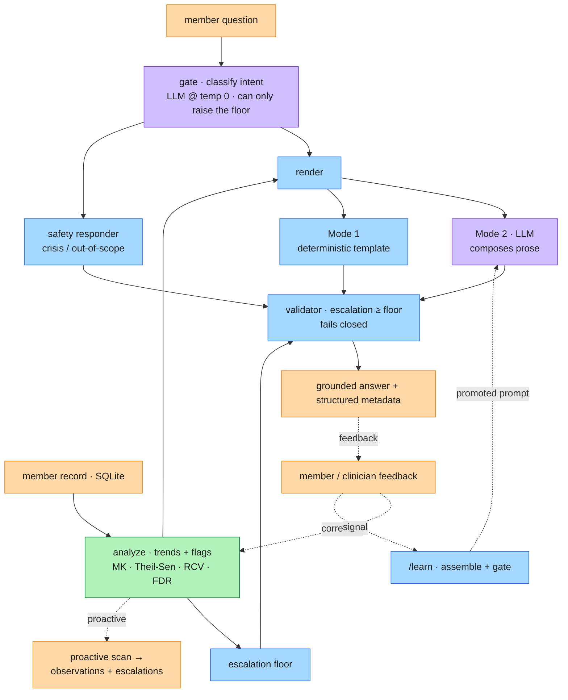

# Health Intelligence Service: Architecture Writeup

The service holds a member's longitudinal record — profile, years of lab panels, conditions, medications, free-text notes; all of it synthetic — and accepts new datasets by upload. It answers free-form questions grounded in the member's own results (Mode 2) or from deterministic templates (Mode 1); unprompted, it scans every trajectory, raises observations when a marker drifts or breaches a threshold, and lands anything needing a human on a worst-first clinician queue. Feedback on any answer feeds a gated learning loop that sharpens the prompt without weakening a safety check.

The whole design comes down to one decision: the LLM is the language layer, not the brain. Every number, trend verdict, and escalation call is computed in plain, unit-tested Python; the model reads intent and writes prose inside guardrails it can't change. That's what makes this a platform rather than a one-off: the parts that matter for safety don't depend on the model, or even on the provider.

## Service diagram

Colour is the owning tier: blue deterministic code, green classical statistics, purple LLM, orange data in and out. The analysis computes an **escalation floor** — the minimum level of concern the code has decided this data warrants; the model can phrase the answer but never lower it, and the validator drops anything below it. The proactive scan is the same pipeline with no question attached.

## Key decisions, and what I left out

**1. Deterministic core; the model only phrases it.** Having the model read raw labs and do the math itself would have been quicker to wire up, but LLMs are unreliable at arithmetic and threshold checks, and a wrong number is the worst failure mode here. So the math returns verdicts, and the model gets those verdicts plus the evidence values to quote — never the raw series, never anything to compute.

**2. SQL, not RAG.** The reflex for "AI over health data" is embeddings and retrieval, but the data per member is small and structured, so it sits in SQLite and is queried directly. Vector retrieval would add an embedding store and a recall failure mode to answer what `WHERE member_id = ?` already answers exactly. So I left it out.

**3. Statistics find the drift — not the model, not a trained classifier.** On every data load the scan checks each marker against its reference range and panic threshold, runs a trend test over its series, and combines both into a severity; the serious ones escalate. Whether a handful of points is a real trend is a statistics question, so it gets statistics chosen for how little data a real panel gives:

- **Mann-Kendall** tests whether a monotonic move is real, with an exact small-sample p-value.
- **Theil-Sen** gives a robust slope a single outlier can't swing.
- **Reference Change Value** counts a shift only when it clears that marker's own biological and analytical noise, not lab jitter.
- **Benjamini-Hochberg** caps false positives across many markers.

At n = 3 they say "too short to call" rather than invent a trend — an LLM will overclaim significance, and a trained classifier has no labels yet and is harder to audit.

**4. Two modes, one pipeline, floor always on.** The pipeline is `retrieve → analyze → floor → render → validate → escalate`; only render changes between modes — deterministic templates (Mode 1, byte-identical every run) or LLM composition (Mode 2). The floor and validator wrap render in both modes, so safety never rides on the mode or the model. The same shape buys consistency: analysis is recomputed from source data on every read (nothing cached); the one stochastic step is the Mode 2 composer — fixed prompt, forced structured output (Sonnet 5 has no temperature setting) — so only the wording varies while the substance holds steady, and the harness measures that variation across three samples. "The deterministic path covers the common case" is a number, not a claim.

## AI vs non-AI boundaries

| Decision point | Tier | Why |
|---|---|---|
| Trend detection (drift vs noise) | Classical statistics, no trained model (Mann-Kendall, Theil-Sen, RCV, FDR) | significance is a statistics question, not a generation one |
| Numbers, range/panic flags, escalation floor | Deterministic code | fixed clinical thresholds, exact and testable |
| Intent routing (in scope, out of scope, emergency) | Generative: LLM classifier at temperature 0, its least-random setting | needs language judgment, but can only raise the floor |
| Phrasing a free-form answer (Mode 2) | Generative: LLM | fluent, member-appropriate language over fixed facts |
| Phrasing a preset answer (Mode 1) | Deterministic templates | the common questions are known ahead of time |
| Final safety check (escalation ≥ floor) | Deterministic validator | the model's output is never the last word on safety |

## Latency budget and cost

| Stage | Latency | Cost (LLM only) |
|---|---|---|
| SQL retrieve | ~5-20 ms | none |
| Statistics | ~10-50 ms | none |
| Compose (LLM), the dominant cost | ~1-2.5 s | ~1-2¢ / ask |
| Validation | ~5-20 ms | none |
| Total (per /ask) | ~1.5-3 s | ~1-2¢ |
| Offline eval run (LangSmith-traced) | off the /ask path | ~$0.50 / run |

The one model call sits on the Mode 2 path, so first responses land in low single-digit seconds; Mode 1 and the proactive scan never call the model at all. A Mode 2 answer runs one to two cents at standard rates; output tokens price at five times input, so capping how much the model writes is the main cost lever.

## Production posture

**Observability.** Every answer persists its full structured response — findings with evidence, routing, escalation, latency, tokens, cost — stamped with the data, model, config, and prompt versions it ran under, so a regression traces to a change and stable finding ids let a correction land on the exact output that produced it. Eval and learning runs stream per-case traces to LangSmith.

**Quality drift.** The release-gating eval harness doubles as the drift monitor: a labeled set re-runs across grounding, safety, escalation, consistency, latency, and cost; three never-events (a missed escalation, a fabricated value, an unrefused directive) block the run outright.

**Responsible AI.** The member gets a plain-language explanation and the evidence; the clinician gets the statistical basis for the same finding. The decision trail is logged pseudonymized; raw identifiable free-text wouldn't go to a third party without controls.

## Feedback loop

Each output carries its findings with stable ids and the version tuple it ran under, so feedback attaches to one specific output. Member-facing prose is recomputed on read, never stored, so a correction can't strand stale text. A correction resolves into the analysis inputs (a clinician range-override, a marker suppression) or the composer's framing (a member preference) — it changes what the system knows, not its rules. A signal (helpful, incorrect, accept, reject) feeds prompt improvement: a candidate is assembled by rule from the signals, the same harness gates it, and it promotes only on zero safety regressions. Feedback is member-scoped and additive, never an in-place rewrite, so one member's correction can't leak into another's findings.

**One limit, confirmed by testing.** The gate certifies a candidate is safe and no worse; it can't yet reward the tone improvement a correction produces (that's the deferred LLM judge). And because it samples the composer once where the harness samples three times, its grounding score carries run-to-run noise — an identical candidate scored differently on consecutive gate runs — so it can false-reject a benign candidate. The safe fix keeps never-events at zero tolerance and scores the soft dimensions across multiple samples.

## How it should land, and one tension

The answer should be calm, specific, and honest about what it doesn't know: show the evidence, say what would change the call, never bury an alarming value under reassurance. The tension I kept hitting: the safest answer and the most reassuring one aren't always the same. I split it — firm on whether to escalate (the deterministic floor fires no matter how the question is phrased), warm on how that lands (plain language for the member, statistics on the clinician's side). Even a refusal follows the split: with the floor raised, the decline restates the next step rather than brushing the member off. Where that line sits is the call the feedback loop is there to tune.

*To try all of this hands-on — the console, the happy path, both feedback loops — see the companion [reviewer guide](operator-guide.md).*
